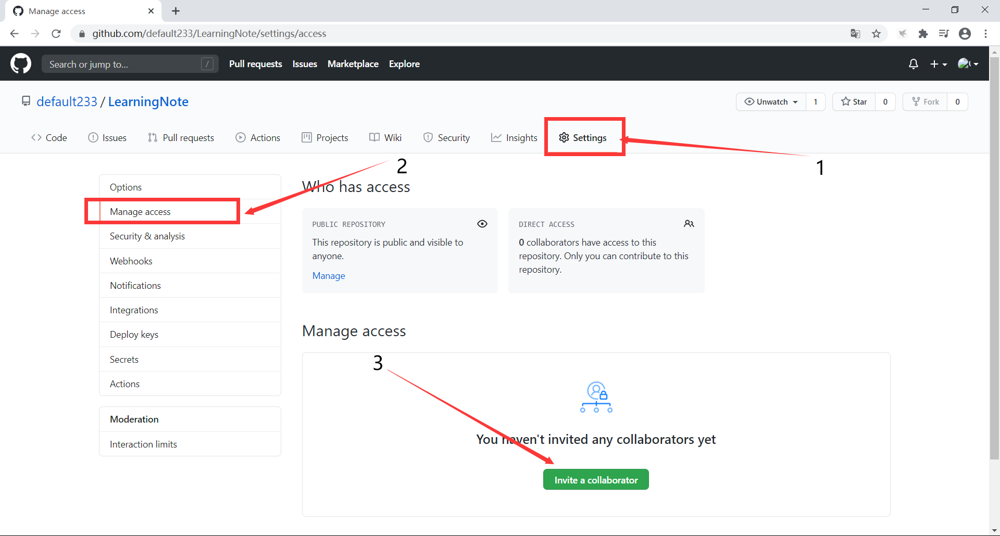
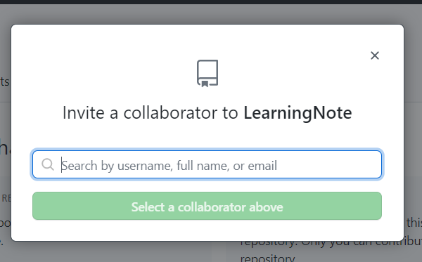

# 一、Git

## 1. 本地初始化

- 命令：

```git
git init
```

- 效果：

  在当前目录下生成 **.git** 隐藏目录

  

## 2. Git 本地结构


## 3. Git 常用命令

### 3.1 查看当前仓库状态

```bash
git status
```


当有文件未添加到暂存区时，文件使用红色标记


当暂存区存在文件没有添加至本地仓库时，文件使用绿色标记


对应以及在缓存区中存在的文件，我们对其修改时，情况如下


### 3.2 将指定文件从工作区添加入缓存区

```bash
git add [文件名]
```


### 3. 3 将指定文件从缓存区添加入本地库

```bash
//此命令会进入vim编辑本次commit提交的备注信息
git commit [文件名]
//此命令会将引号当中字符作为备注信息，无需进入vim编辑
git commit -m "备注" [文件名]
```


==可以直接使用git commit命令绕过缓存区，直接将文件添加至本地库==


### 3.4 查看本地日志

```bash
git log
```


当日志信息较多时，采用多屏显示

使用

- 空格向下翻页
- b向上翻页
- q退出

```bash
//查看简单日志信息，单行
git log --pretty=oneline
```


```bash
//查看简单日志信息，单行，索引只显示后几位，版本只显示当前版本之前的版本
git log --oneline
```


```bash
//查看带指针索引的日志
git reflog
```


### 3.5 版本回退

#### 3.5.1 根据索引值选择版本

```bash
git reset --hard [索引值]
```


再次查看日志


#### 3.5.2 使用“^”符号进行版本回退

```bash
//在HEAD后添加若干个"^"符号，一个"^"表示向前回退一个版本
git reset --hard HEAD^^
```


#### 3.5.2 使用“~”符号进行版本回退

```bash
//在在HEAD后添加"~"符号，其后紧跟数字表示向前回退几个版本
git reset --hard HEAD~3  //表示回退三个版本
```

#### reset 命令参数对比

- hard
  - 将工作区缓存区重置为指定版本
  - 移动前后本地库、工作区、缓存区处于同一版本
- mixed
  - 将缓存区重置为指定版本
  - 移动后：
  - 
  - 此时查看缓存区状态时，文件为红色标记
- soft
  - 只将本地仓库的指针HEAD移动至本地版本
  - 移动后
  - 
  - 此时查看缓存区状态时，文件为绿色标记

### 3.6 删除与找回文件（本地库中）

将文件添加至本地库之后，仅在工作区删除文件，查看当前状态


使用红色标记

```bash
deleted:  aaa.txt
```

使用add和commit操作将该条改变添加至本地库


此时相当于将此时的版本添加至本地库，但仍可以通过版本回退找回

当只执行了add而未执行commit操作时，我们可以通过

```bash
git reset --hard HEAD
```

命令，使得当前工作区同步为当前本地库的版本，此时就可以找回被删除的文件

### 3.7 比较文件

```bash
//默认比较工作区和缓存区的文件差别
git diff [文件名]
//可以在diff后面添加HEAD指针，将工作区与本地库某个版本的差别
git diff HEAD^ [文件名]
//省略文件名可以比较多个文件的不同
git diff HEAD
```


### 3.8 查看命令的帮助文档

```bash
git help [命令]
```

## 4. Git 分支

Git 使用branch对项目进行分支管理，各个分支直接可以相对独立开发运行互不影响

进行初始化后，Git 默认创建一个 master 分支，之后的分支就在此分支上复制产生。

常用命令

### 4.1 查看当前所处的分支

```bash
git status
```


### 4.2 创建分支

```bash
git branch [分支名]
```

### 4.3 查看当前所有分支

```bash
git branch -v
```


### 4.4 切换当前所处分支

```bash
git checkout [分支名]
```


### 4.5合并分支

合并分支前，首先要站在需要将其他分支合并过来的主分支上

```bash
git merge [分支名]
```

当产生合并冲突时，我们需要对其进行解决


首先我们修改两个分支当中的good.txt文件，使得产生不一致

下面我们将master分支当中的内容合并到feature_test分支当中

第一步：切换到feature_test

```bash
git checkout feature_test
```

第二步：merge

```bash
git merge -m "备注" master
```

第三步：编辑merge的文件，解决冲突

第四步：commit

一定不要添加文件名

==笔者版本 2.26.0.windows.1 默认覆盖，尚未找到原因==

# 二、GitHub

## 1.GitHub 账号注册

登录 https://github.com/ 首页，注册用户名、秘密、邮箱和密码，之后登录邮箱进行激活。

## 2. 新建GitHub远程仓库

登录首页后点击图示内容便可以新建仓库


点击进入新建页面


输入信息后进入提示页面


## 3. 新建本地仓库

使用 `git init` 初始化命令本地仓库 。将工作区文件使用add、commit加入本地仓库，添加当前目录下所有文件时add后添加.

## 4. 为远程仓库起别名

查看所有远程目录的别名

```bash
git remote -v
```

为某个远程目录起别名

```bash
git remote add [别名] [远程仓库地址]
```

修改别名

```bash
git remote set-url [别名] [新地址]
```


## 5. 将本地仓库上传至远程仓库

使用如下命令

```bash
git push [远程仓库地址或别名] [指定远程仓库分支]
```

之后登录账号和密码

==如果此时本地仓库内容不是基于远程仓库最新版进行推送时，Git会要求先将远程仓库的内容pull下来并通过merge解决冲突后再进行推送==

## 6. 将远程仓库clone至本地

```bash
git clone [远程仓库地址]
```

此命令进行了如下三个操作

1. 初始化本地仓库，在当前目录下生成了`.git`文件

2. 将远程仓库内的文件clone至本地仓库
3. 将远程地址命名为origin

## 7. 添加仓库的人员



按照图示步骤

点击之后在弹窗中输入账号用户名或邮箱名，点击邀请



被邀请的用户需要在登录状态下访问该远程仓库地址接受邀请，后续即可对该仓库进行操作

## 8. 获取远程仓库更新的内容

在获取远程仓库的命令时

> pull = fetch + merge

```bash
git pull [远程仓库别名] [远程仓库分支名]
git fetch [远程仓库别名] [远程仓库分支名]
git merge [远程仓库别名]/[远程仓库分支名]
```

