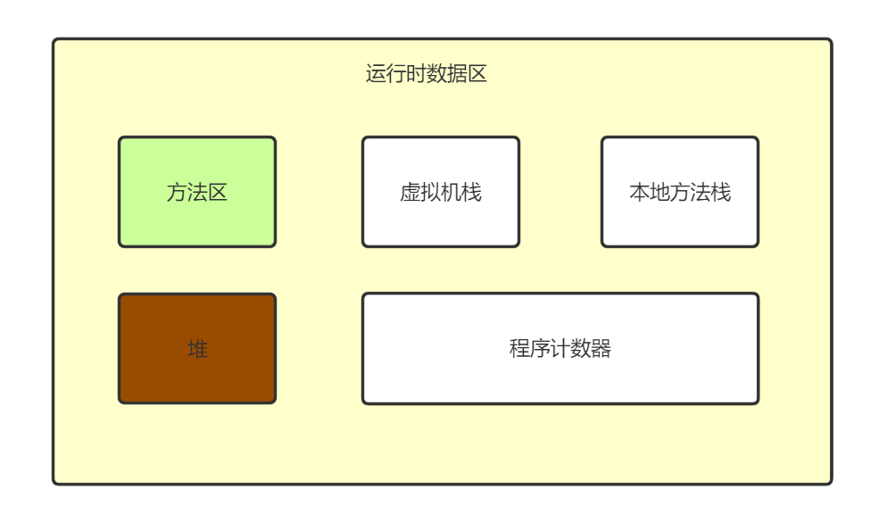

# JVM内存模型

## 1.  运行时数据区

Java虚拟据在运行时将其所管理的内存划分为不同的区域分别进行管理，包括以下几个运行时数据区域



### 1.1 程序计数器（Program Counter Register）

程序计数器可以看作是当前线程所执行的字节码程序的行号指示，用于表示当前线程执行到的位置。

- 程序计数器是线程私有，线程之间不共享，每个线程都有一个属于自己的程序计数器

- 线程在执行Java方法时，程序计数器记录当前正在执行的虚拟机字节码的指令地址
- 线程在执行本地方法时，程序计数器值为空

### 1.2 栈（Stack）

栈描述的是方法执行时的线程内存模型，每个方法执行时，Java虚拟机都会同步创建一个栈帧用于存储局部变量表、操作数栈、动态链接、方法出口等信息，方法调用到执行完毕的过程，对应一个栈帧从入栈到出栈的过程。

- 栈也是线程私有的，与线程具有相同的生命周期

Java栈内存模型分为两类，一类是**虚拟机栈（Java Virtual Machine Stack）**，用于存储Java方法栈帧；一类是**本地方法栈（Native Method Stack）**，用于存储本地方法栈帧。

- 局部变量表存放了编译期可知的各种Java基本数据类型、对象引用
- 方法出口returnAddress存放了方法执行完毕后，下一条该执行的字节码指令地址

- 操作数栈可理解为java虚拟机栈中的一个用于计算的临时数据存储区
- 指向运行时常量池的引用实现动态链接

### 1.3 堆（Heap）

堆是虚拟机所管理的最大的一块内存模型，几乎所有的对象实例，以及数组都是存放在堆内存中的

- 堆是被所有线程共享的一块内存区域
- Java堆可以处于物理上不连续的内存空间中

### 1.4 方法区（Method Area）

方法区用于存储被虚拟机加载的类型信息、常量、静态变量、即时编译器编译后的代码缓存等数据

- 方法区也是各个线程共享的内存区域

#### 运行时常量池

虚拟机在类加载后，将class文件中的常量池表的信息存放在方法区的运行时常量池中；

常量池表存放编译期生成的各种字面量与符号引用。

字面量举例

```java
int a = 1; // 1 即为字面量
String b = "abc"; // "abc" 也为字面量
```

在java中，一个java类将会编译成一个class文件。在编译时，java类并不知道引用类的实际内存地址，因此只能使用符号引用来代替。比如org.simple.People类要引用org.simple.Tool类，在编译时People类并不知道Tool类的实际内存地址，因此只能使用符号org.simple.Tool(假设)来表示Tool类的地址。而在类装载器装载People类时，此时可以通过虚拟机获取Tool类 的实际内存地址，因此便可以既将符号org.simple.Tool替换为Tool类的实际内存地址，及直接引用地址。

### 1.5 直接内存

直接内存并不是虚拟机运行时数据区的一部分，但是这部分内存也被频繁使用。在使用NIO的基于通道和缓冲区的I/O方式时，使用函数直接分配了堆外内存，这部分内存就是直接内存。

## 2. 对象的创建过程

1. 虚拟机在遇到一条字节码new指令时，会先去检查该指令对应的类是否被虚拟机加载、解析和初始化过，如果没有，则必须先执行类加载机制。

2. 在类加载检查通过后，该对象所需的内存空间大小即可确定，此时需要在Java堆中划分一块确定大小的内存块

- 如果堆内存是规整的，即所有使用过的内存放在一边，空闲内存放在另一边，中间是指针所为分界点的指示器，此时仅需将指针向空闲方向移动一段距离，该方法称为“指针碰撞”；
- 如果堆内存不是规整的，需要维护一个空闲列表，记录堆上那些内存是可用的，进而更新列表

由于堆是所有线程共享的，因此在内存划分的过程中可能会产生同步问题，解决方案有

- 对分配内存的动作采取同步处理，如CAS、加锁等
- 把内存分配的动作按照线程划分在不同的空间中进行，每个线程在Java堆中预先分配一块内存，称为本地线程分配缓冲

3. 内存分配完成后，虚拟机需要将分配的内存空间初始化为0值

4. 设置对象的对象头，对象头中包括：对象的类型信息、对象的哈希码、对象的GC分代年龄信息、类的元数据信息等待

5. 执行对象的构造方法，进行最后的初始化。