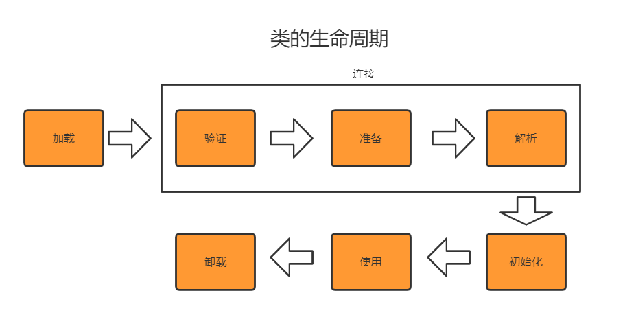
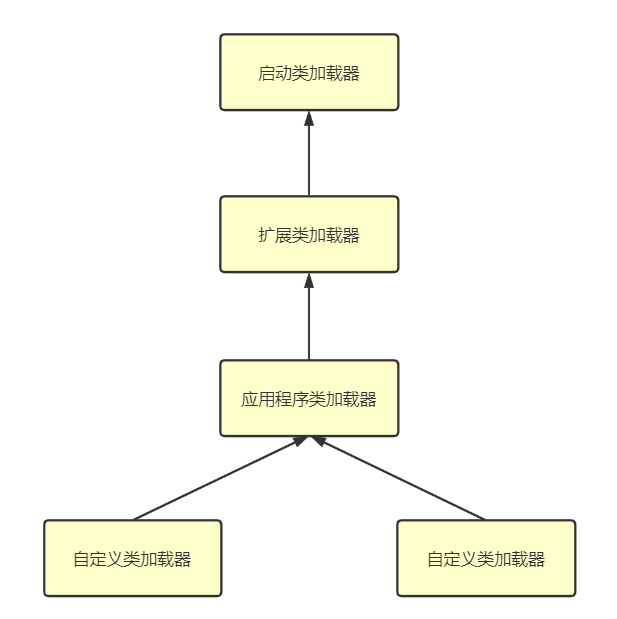

# 虚拟机类加载机制

Class文件中描述了类的各种信息，但最终都需要加载到虚拟机中之后，才能被运行和使用。

## 1. 类加载的时机

一个类型，从被加载到虚拟机内存中开始，到卸载处内存为止，它的整个生命周期将会经历

- 加载（Loading）
- 验证（Verification）
- 准备（Preparation）
- 解析（Resolution）
- 初始化（Initialization）
- 使用（Using）
- 卸载（Unloading）

七个阶段。

其中验证、准备、解析三个部分统称为

- 连接（Linking）



加载、验证、准备、初始化和卸载这五个阶段的顺序是确定的，而解析阶段在某些情况下可以在初始化阶段之后再开始，这是为了支持Java语言的运行时绑定特性。

==注意，上述顺序是开始顺序，这些阶段通常都是相互交叉地混合进行的，会在一个阶段执行的过程中调用、激活另一个阶段==

《Java虚拟机规范》并没有规定在什么情况下需要开始类的加载过程，但是严格规定了有且只有六种情况，必须对类进行“初始化”（加载、验证、准备自然需要在此之前开始）。

我们就以此六种情况作为类的加载时机看待：

1）遇到new、getstatic、putstatic或invokestatic这四条字节码指令时，如果类型没有进行过初始化，则需要先触发其初始化阶段。能够生成这四条指令的典型Java代码场景有：

- 使用new关键字实例化对象时
- 读取或设置一个类型的静态字段时（被final修饰、已在编译期把结果放入常量池的静态字段除外）
- 调用一个类型的静态方法时

2）使用java.lang.reflect包的方法对类型进行反射调用的时候，如果类型没有进行过初始化，则需要先触发其初始化

3）当初始化类的时候，如果发现其父类还没进行过初始化，则需要先触发其父类的初始化

4）当虚拟机启动时，用户需要指定一个要执行的主类（即包含main()方法的那个类），虚拟机会先初始化这个主类

5）当使用JDK 7新加入的动态语言支持时，如果一个java.lang.invoke.MethodHandle实例最后的解析结果为REF_getStatic、REF_putstatic、REF_invokestatic、REF_newInvokeSpecial四种类型的方法句柄，并且这个方法句柄对应的类没有进行过初始化，则需要先触发其初始化

6）当一个接口中定义了JDK 8新加入的默认方法（被default关键字修饰的接口方法）时，如果有这个接口的实现类发送了初始化，那该接口要在其之前被初始化

这六种场景被称为对一个类型进行主动引用。除此之外，所有的引用类型方式都不会触发初始化，称为被动引用。

三个被动引用的例子

例一：

```java
/**
 * 被动引用类字段演示一：
 * 通过子类引用父类的静态字段，不会导致子类的初始化
 */
public class SuperClass {
	static {
		System.out.println("SuperClass init!");
	}

	public static int value = 123;
}

public class SubClass extends SuperClass {
	static {
		System.out.println("SubClass init!");
	}
}

/**
 * 非主动使用类演示
 */
public class TestInit {
	public static void main(String[] args) {
		System.out.println(SubClass.value);
	} 
}
```

上述程序的运行结果为：

```java
SuperClass init!
123
```

对于静态字段，只有直接定义这个字段的类才会被初始化，因此通过子类来引用父类中定义的静态字段，只会触发父类的初始化而不会触发子类的初始化。

例二

```java
/**
 * 被动引用类字段演示二：
 * 通过数组来定义引用类，不会触发此类的初始化
 */
public class TestInit {
	public static void main(String[] args) {
		SuperClass[] sca = new SuperClass[10];
	} 
}
```

此程序运行之后并==没有==输出

```java
SuperClass init!
```

例三

```java
/**
 * 被动引用类字段演示三：
 * 常量在编译阶段会存入调用类的常量池中，本质上没有直接引用到定义常量的类，因此不会触发定义常量的类的初始化
 */

public class ConstClass {
	static {
		System.out.println("ConstClass init!");
	}

	public static final String HELLOWORLD = "hello world";
}

/**
 * 非主动使用类演示
 */
public class TestInit {
	public static void main(String[] args) {
		System.out.println(ConstClass.HELLOWORLD);
	} 
}
```

上述程序的运行结果为：

```java
hello world
```

并没有输出“ConstClass init!”。原因是在编译阶段通过常量传播优化，将此常量的值“hello world”直接存储在TestInit的常量池中，以后再使用该引用是，都被转换为对常量池的引用了。

## 2. 类加载过程

### 2.1 加载

在加载阶段，Java虚拟机需要完以下三件事情：

1）通过一个类的全限定名来获取定义此类的二进制字节流

2）将这个字节流所代表的静态存储结构转化为方法区的运行时数据结构

3）在内存中生成一个代表这个类的java.lang.Class对象，作为方法区这个类的各种数据的访问入口

对于（1），Java虚拟机规范并没有规定二进制字节流必须从Class文件获取，还有以下获取方式：

- 从ZIP、JAR、EAR、WAR等压缩包中读取
- 运行时计算生成，如动态代理技术
- 有其他文件生成，如JSP文件
- 从网络中获取，如Web Applet
- 从数据库中读取
- 从加密文件中获取
- ......

对于非数组类的类型加载，开发人员可以选择加载类的类加载器，也可以控制字节流的获取方式，类的加载阶段是整个类加载过程中，开发人员可控性最强的阶段。

数组类的加载过程有所不同，数组类本身不通过类加载器创建，是由Java虚拟机直接在内存中动态构造出来的，数组的元素类型最终还是要依赖类加载器来完成加载。

数组类创建过程遵循以下规则：

- 如果数组的组件类型是引用类型，那就递归加载组件类型
- 如果数组的组件类型不是引用类型，Java虚拟机会把数组标记为与引导类加载器关联
- 数组类的可访问性与它的组件类型的可访问性一致，如果组件类型不是引用类型，它的数组类的可访问性将默认为public

加载阶段与连接阶段的部分动作是交叉进行的，加载阶段尚未完成时，连接阶段可能已经开始。

### 2.2 验证

验证是连接阶段的第一步，这一阶段的目的是确保Class文件的字节流中包含的信息符合《Java虚拟机规范》的全部约束要求，保证这些信息被当作代码运行后不会危害虚拟机的自身安全。

验证阶段会完成四个阶段的检验：

- 文件格式验证

  验证字节流是否符合Class文件格式的规范，并且能被当前版本的虚拟机处理

- 元数据验证

  对字节码描述的信息进行语义分析，保证其描述的信息符合《Java语言规范》的要求，如

  - 这个类是否有父类
  - 是否继承了不允许被继承的类
  - 如果不是抽象类，是否实现了要求实现的所有方法
  - 类中的字段方法是否与父类矛盾
  - ......

- 字节码验证

  通过数据流分析和控制流分析，确定程序语言是合法的、符合逻辑的。第二阶段对元数据信息中的数据类型校验完毕后，这个阶段就对类的方法体进行校验分析

- 符号引用验证

  该校验行为发生在虚拟机将符号引用转化为直接引用的时候，这个转化动作将在连接的第三阶段——解析阶段中发生。符号引用的目的主要是保证解析行为能够正常运行，通常要校验以下内容：

  - 符号引用中通过字符串描述的全限定名是否能够找到对应的类
  - 在指定类中是否存在符号方法的字段描述符及简单名称所描述的方法和字段
  - 符号引用中的类、字段、方法的可访问性
  - ......

### 2.3 准备

准备阶段是正式为类中定义的变量（静态变量）分配内存并设置类变量初始值的阶段。从概念上将，这些变量使用的内存应该在方法区中分配，在JDK 1.7之前，HotSpot使用永久代来实现方法区。而在JDK 1.8之后，元空间取代了永久代，而类变量会随着Class对象一起存放在Java堆中。

对于初始值：这里所说的初始值通常指的是对应数据类型的零值，但如果字段被定义为静态常量，则初始值会设置为开发人员所赋予的值。

```java
public static final int value = 123;//此时准备阶段时，value的初始值就为123
```

### 2.4 解析

解析阶段是Java虚拟机将常量池内的符号引用替换为直接引用的过程。

解析动作主要针对于类或接口、字段、类方法、接口方法、方法类型、方法句柄和调用点限定符这七类符号引用进行。

### 2.5 初始化

初始化阶段基本属于类加载过程的最后一个步骤，初始化阶段完成后，Java虚拟机将主动权移交给应用程序，开始真正执行类中编写的Java程序代码。

在初始化阶段，会根据程序员通过程序编码制定的主观计划区初始化类变量和其他资源。

初始化阶段就是执行类构造器<clinit>()方法的过程。<clinit>()是Javac编译器的自动生成物。

- <clinit>()方法是编译器自动收集类中的所有类变量的赋值动作和静态语句块（static{}块）中的语句合并产生的，编译器收集的顺序是由语句在源文件中出现顺序决定的。静态语句块中只能访问到定义在静态语句块之前的变量，定义在它之后的变量，在前面的静态语句块可以赋值，不能访问
- <clinit>()与类的构造函数不同，它不需要显式地调用父类构造器，Java虚拟机会保证在子类的<clinit>()方法执行前，父类的<clinit>()方法已经执行完毕。
- 由于父类的<clinit>()方法先执行，因此父类静态语句块要优先于子类的变量赋值操作
- <clinit>()方法对于类或接口来说不是必须的，如果一个类中没有静态语句块，也没有对变量的赋值操作，那么编译器就可以不为这个类生成<clinit>()方法
- 接口中不能使用静态语句块，但仍然有变量初始化的赋值操作，因此接口与类一样都会生成<clinit>()方法。但接口与类不同的是，执行接口的<clinit>()方法不需要先执行父接口的<clinit>()方法。
- Java虚拟机需要保证类的<clinit>()方法能够在多线程中被正确地加锁同步。

## 3. 类加载器

实现“从类的全限定类名到类的二进制字节流”动作的代码被称为类加载器。

注：判定两个类相等的条件：缺一不可

- 两个类来源于同一个Class文件
- 被同一个Java虚拟机加载

### 3.1 双亲委派模型

自JDK 1.2以来，Java一直保持着三层类加载器、双亲委派的类加载架构。

三个系统提供的类加载器：

- 启动类加载器（Bootstrap Class Loader）：这个类加载器负责加载存放在 JAVA_HOME\lib 目录，或者被 -Xbootclasspath 参数所指定的路径中存放的，而且是Java虚拟机能够识别的（按照文件名识别，如rt.jar、tools.jar，名字不符合的类库即使放在lib目录下也不会被加载）类库加载到虚拟机的内存中。启动类加载器无法被Java程序直接引用。
- 扩展类加载器（Extension Class Loader）：这个类加载器负责加载 JAVA_HOME\lib\ext 目录中，或者被 java.ext.dirs 系统变量所指定的路径中所有的类库。
- 应用程序类加载器（Application Class Loader）：这个类加载器也被称为系统类加载器，因为ClassLoader类中的getSystenmClassLoader()方法的返回值即为该类加载器。它负责加载用户类路径（ClassPath）上所有的类库。

如果用户认为有必要，可以加入自定义的类加载器来进行拓展。这些类加载器的协作关系如图



在各种类加载器之间的层次关系被称为类加载器的“双亲委派模型（Parents Delegation Model）”。

双亲委派模型要求除了顶层的启动类加载器外，其余类加载器都应有自己的父类加载器。类加载器的父子关系不是用继承来实现的，而是使用组合关系来复用父加载器的代码。

双亲委派模型的工作过程：如果一个类加载器收到了类加载的请求，它首先不会自己去尝试加载这个类，而是把这个请求委派给父类加载器去完成，每一个层次的类加载器都是如此，因此所有的加载请求最终都应该传送到最顶层的启动类加载器中，只有当父加载器反馈自己无法完成这个加载请求时，子加载器才会尝试自己去完成加载。