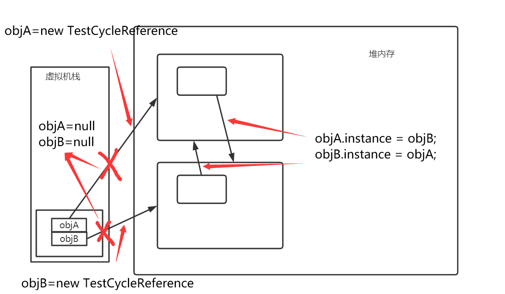
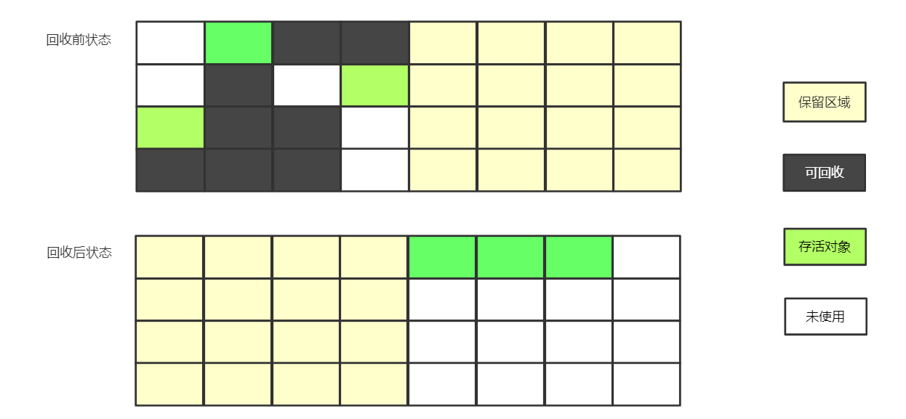
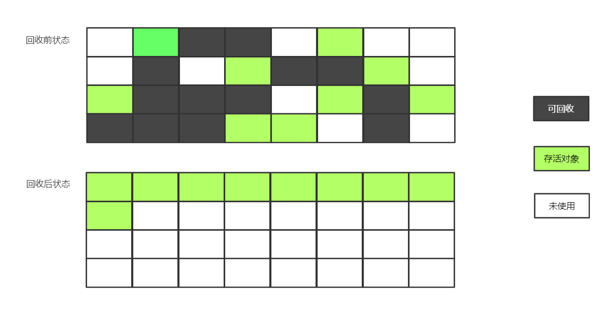

# JVM垃圾回收机制

Java语言在设计之初就考虑到C++复杂的指针管理和内存泄漏等问题，因此实现了内存动态分配和垃圾内存的自动回收技术。

## 1. 垃圾回收需要考虑的问题

- 那些内存属于垃圾，需要垃圾回收器进行回收？
- 何时对垃圾进行回收？
- 如何对垃圾内存进行回收？

## 2. 如何判断对象所占用的内存成为垃圾？

Java虚拟机为了解决垃圾回收的第一个问题，首先就要判断当前内存中那些对象成为了垃圾，也就是不再被人使用。

有两种经常提及的算法

### 2.1 引用计数算法

> 在对象中添加一个引用计数器，当有一个地方引用它市，引用计数器的值就加一，当有一个引用失效时，对象计数器的值就减一。

引用计数算法的特点：

- 算法原理简单，实现简单，判定效率较高

- 当出现循环引用的情况时，引用计数器就会失效照成内存泄漏

在下诉例子中，由于对象在进行完 objA 和 objB 的 instance 成员赋值后，这两个对象便不可能再被访问，但是由于它们互相引用着对方，他们的引用计数器都不为0，因此就无法被判定为垃圾对象。

```java
public class TestCycleReference {
    public Object instance = null;
    public static void test() {
        TestCycleReference objA = new TestCycleReference();
        TestCycleReference objB = new TestCycleReference();
        
        objA.instance = objB;
        objB.instance = objA;
        
        objA = null;
        objB = null;
    }
}
```

内存结构图如下：



### 2.2 可达性分析算法

主流的商用程序语言（如Java、C#）的内存管理，都是通过可达性分析算法来判断对象是否存活的

> 可达性分析算法通过一系列称为“GC Roots”的对象作为根节点，从这些节点开始，根据引用关系向下搜索，搜索过程所走过的路径称为引用链，如果一个对象到GC Roots之间没有任何引用链相连，那么该对象被判定为不可用

可达性分析算法解决了引用计数算法中循环引用的问题，关键则在于GC Roots的选定。

在Java体系中，常见的GC Roots对象包括以下几种

- 在虚拟机栈中引用的对象（方法中的参数、局部变量、临时变量）
- 方法区中，类的静态属性引用的对象
- 在方法区中，常量引用的对象
- 在本地方法栈中native方法引用的对象
- Java虚拟机内部的引用（Class对象、常驻的异常对象、系统类加载器）
- 被同步锁（synchronized关键字）持有的对象
- 反应Java虚拟机内部情况的JMXBean、JVMTI中注册的回调、本地代码缓存等

## 3. 垃圾回收算法

### 3.1 分代收集理论

分代收集理论建立在两个分代假说之上

- 弱分代假说：绝大多数对象都是朝生夕灭的，生命周期很短
- 强分代假说：熬过越多次垃圾收集过程的对象就越难以消亡

分代假说奠定了垃圾回收期的设计原则

Java堆应该划分出不同的区域，将对象根据其生命周期的长短，分配到不同的区域之中存储。这样一来，垃圾回收器就可以根据不同区域对象生命周期的特点，采取不同的回收策略。

在Java虚拟机中，设计者一般会将Java堆划分为新生代和老年代。

> 新生代（Young Generation）：新生代中对象生命周期一般较短，每次收集垃圾时，都有大批对象死去，因此只需要标记少量存活的对象，而处理未被标记的对象，而每次回收后存活的少量对象，则会逐渐晋升到老年代中

> 老年代（Old Generation）：老年代中对象的生命周期较长，因此对于老年代来说，垃圾收集的频率就会明显低于新生代

基于上述假说形成的分代会出现以下问题

如果新生代中的对象被老年代中的对象所引用，那么为了找出新生代中的存活对象，就必须额外遍历老年代中所有的对象，来保证可达性分析结果的正确性，反之相同。

因此引入了第三个假说：

- 跨代引用假说：跨代引用相对于同代引用来说仅占极少数

根据前两条假说，我们可以做出如下推论：存在引用关系的两个对象应该倾向于同时生存或者同时消亡的

在第三个假说成立的条件下，我们就可以在新生代中建立名为“记忆集”的数据结构，它将老年代划分为若干小块，标识出老年代的哪一块内存会存在跨代引用。之后在进行标记扫描时，仅需扫描包含了跨代引用的小块内存。

### 3.2 标记-清除算法

该算法分为“标记”和“清除”两个阶段。

有两种基本的实现方式

- 可以先标记出所有需要回收的对象，标记完成后，统一回收掉所有被标记的对象
- 可以标记出存活的对象，统一回收所有未被标记的对象

标记-清除算法的特点

- 标记-清除算法是最基础的算法，后续的许多算法都是以此算法为基础
- 执行效率不稳定，随着内存中对象数量的增加，算法会进行大量的标记-清除动作，执行效率下降
- 标记-清除算法会产生大量的不连续的内存碎片

### 3.3 标记-复制算法

标记-复制算法将可用的内存容量分为两块，每次只使用一块，当其中一块的内存用完了，就将还存活的对象复制到另外一块上面，然后再把已使用过的内存空间一次性清理掉。

- 如果内存中多数的对象都是存活的，那么这种算法将会因复制对象产生大量的开销
- 如果多数对象都将被回收，那么只需将少量的对象复制即可

这种算法的代价就是将可用的内存缩小了一半。



在商用Java虚拟机中，采用标记-复制算法回收新生代，根据IBM公司调查，在新生代中，有98%的对象熬不过第一轮收集，因此也不需要使用1：1的比例划分新生代内存空间。

对上述内存划分进行改进后形成“Appel”式回收。

具体做法是，将新生代划分为一块较大的Eden空间和两块较小的Survivor空间。每次分配内存只使用Eden和其中的一块Survivor空间。

当发送垃圾收集时，将Eden和Survivor空间中仍然存活的对象，一次性复制到另外一块Survivor空间上，然后直接清理掉Eden和用过的那块Survivor空间。

Eden 和 Survivor 大小的默认比例是8：1。

当一块Survivor空间不足以存放存活的对象时，就需要依赖老年代区域进行分配担保。

### 3.4 标记-整理算法

由于标记复制算法在存活对象多的老年代中，会进行较多的复制操作，因此老年代采取了一种“标记-整理算法”来提高效率。

标记-整理算法执行流程：当进行垃圾回收时，将标记为存活的对象都移动到内存空间的一端，然后直接清除掉边界意外的内存区域



由于老年代中每次回收都有大量的对象存活，因此移动存活对象是一个极大的开销

如果采用标记-清除这种完全不考虑移动和整理存活对象的话，对中的空间碎片化问题就会导致采取更为复杂的算法解决内存分配问题

