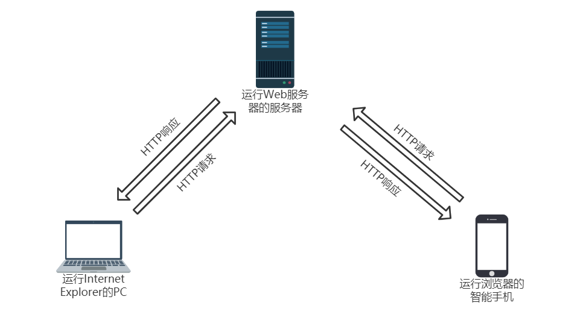
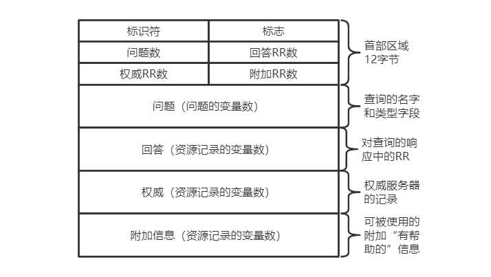

# 应用层协议及原理

网络应用是计算机网络存在的原理。

我们通过计算机和手机软件使用网络，因此网络应用层是学习协议非常好的起点。

## 1. 应用层协议及其原理

### 1.1 网络应用程序体系结构

现代网络应用程序中使用两种主流体系结构：

- 客户——服务器体系结构
- 对等（P2P）体系结构

#### 客户——服务器体系结构

在该体系结构中，有一个总是打开的主机，我们将其称为**服务器**。服务器服务许多来自其他称为**客户**的主机的请求。

例如Web服务器总是服务于来自客户机上浏览器发出的**请求**，并向该客户发送所请求对象的**响应**。

#### P2P体系结构

在此体系结构下，应用程序在间断连接的主机之间使用直接通信，因此这些主机为**对等方**。

### 1.2 进程通信

在计算机网络中，我们考虑的进程通信指的是运行在不同端系统中的进程间的相互通信。

不同端系统的进程通过跨越计算机网络交换**报文**而通信。

#### 1.2.1 客户和服务器进程

> 我们将每一对通信进程中，发起通信的进程标识为客户，而在会话开始时，等待联系的进程标识为服务器

#### 1.2.2 进程与计算机网络之间的接口

两个进程在发送报文和接收报文进行通信时，必须经过下面的网络。

进程通过一个称为**套接字（socket）**的软件接口向网络发送报文和从网络接收报文。

类比：将进程比作一座房子，而套接字就相当于门，传递信息的报文需要经过门，才能进入进程内。

套接字是一台主机内应用层和运输层之间的接口，也是进程与计算机网络之间的接口。

套接字是建立在网络应用程序的可编程接口，开发者可用控制套接字在应用层端的一切，但对运输层的控制仅限于

- ①选择运输层协议；
- ②设定若干运输层参数，如最大缓存和最大报文段长度等。

#### 1.2.3 进程寻址

类似邮件需要一个目的地地址一样，进程间的通信也需要有一个地址，该地址由两部分组成

- IP地址，用于在因特网中唯一标识一台主机。相当于目的主机地址
- 端口号，由于一台主机同时运行的进程不止一个，在找到主机时仍需找到对应哪个进程，因此端口号用于标识主机中的进程，相当于进程的ID。

### 1.3 可供应用程序使用的运输服务

许多网络提供了不止一种运输层协议。当开发一个应用时，我们需要根据需求选择合适的运输层协议。

运输层为应用层提供了以下几种服务，协议则是这些服务的组合。

#### 可靠的数据传输

将数据完整地、按序地、正确地从一端交付给另一端

#### 吞吐量

以某种特定的速率提供确保的可用吞吐量（适用于带宽敏感的应用）

#### 定时

定时能够保证每个比特从发送方到接收方不超过100ms

#### 安全性

运输层协议能够加密由发送进程传输的数据，并在接收进程处进行解密

### 1.4 因特网提供的运输服务

因特网为应用程序提供两个运输层协议，即UDP和TCP

#### 1.4.1 TCP服务

- 面向连接的服务：在应用层数据报文开始传输之前，TCP先让客服和服务器互相交换控制信息，经过一个三次握手的过程，在两个进程的套接字之间建立一个TCP连接，这条连接是全双工的，即，连接双方的进程都可以在连接上进行报文的接收和发送。当应用程序结束报文收发时，连接中断。详细细节待更新。
- 可靠的数据传输服务：通信进程能够依靠TCP，无差错、按适当顺序交付所有发送的数据，没有丢失和冗余。

TCP协议还具有拥塞控制机制，但此机制更是为了整个互联网，而不一定能为当前通信进程带来直接好处。

#### 1.4.2 UDP服务

UDP是一种不提供不必要服务的轻量级运输协议，它仅提供最小服务。

- UDP是基于无连接的，因此没有通信前的握手服务
- UDP协议提供的是不可靠的数据传输服务
- UDP没有包括拥塞控制机制，因此发送端可用它选定的速率向其下层网络注入数据

#### 1.4.3 关于安全

无论TCP还是UDP都没有直接提供任何加密机制。

而因特网界研发了TCP的加强版本，称为**安全套接字（Secure Sockets Layer，SSL）**。用SSL加强后的TCP，提供了包括加密、数据完整性和端点鉴别等安全服务。

#### 1.4.4 流行的应用层协议对应的运输层协议

|     应用     | 应用层协议     | 支撑的运输层协议 |
| :----------: | :------------- | ---------------- |
|   电子邮件   | SMTP           | TCP              |
| 远程终端访问 | Telnet         | TCP              |
|     Web      | HTTP           | TCP              |
|   文件传输   | FTP            | TCP              |
|  流式多媒体  | HTTP           | TCP              |
|  因特网电话  | SIP、RTP或专用 | UDP或TCP         |
|   域名服务   | DNS            | UDP              |
| 简单文件传输 | TFTP           | UDP              |

## 2. Web和HTTP

### 2.1 HTTP概况

Web的应用层协议是**超文本传输协议（HyperText Transfer Protocol，HTTP）**。

HTTP由两个程序实现：一个用户程序和一个服务器程序。两个程序运行在不同的端系统中，通过交换HTTP报文进行会话。

HTTP协议定义了这些报文的结构以及客户和服务器进行报文交换的方式。

Web浏览器实现了HTTP的客户端，Web服务器实现了HTTP的服务端。

Web页面是由对象组成的。一个对象一般是一个文件，如HTML文件、JPEG图形、Java小程序等，他们通过一个URL地址寻址。URL地址由两部分组成：存放对象的服务器主机名和对象的路径名。

### 2.2 非持续连接和持续连接

如果每一对请求和响应是经过一个单独的TCP连接发送，则使用的是非持续连接，如果多个请求和响应是经同一个TCP连接发送，则使用的是持续连接。

### 2.3 HTTP通信流程

### 2.4 HTTP报文格式

#### 2.4.1 HTTP请求报文

HTTP请求报文由四部分组成

- 请求行（Request Line）
- 请求头（Request Header）
- 空白行
- 请求体（Request Body）

每行由一个回车和换行符表示结束

##### ①请求行

**方法**：请求方法指示了本次请求所采取的方式，常见的请求方式包括

| 请求方式 | 描述                                                         |
| -------- | ------------------------------------------------------------ |
| GET      | 向特定的资源发出请求                                         |
| POST     | 向指定资源提交数据进行处理请求。数据被包含在请求体中         |
| HEAD     | 向服务器索与GET请求相一致的响应，只不过响应体将不会被返回。主要作用是获得响应消息头中的信息 |
| PUT      | 向指定资源位置上传其最新内容                                 |
| DELETE   | 请求服务器删除Request-URL所标识的资源                        |

Web服务器至少应该包括POST、GET请求方式

GET、POST请求方式的区别请见：[POST/GET请求方式的区别](https://blog.csdn.net/RegretLi/article/details/108510783)

**URL**：Uniform Resource Locator,统一资源定位器，请求对象的标识。一般由三部分组成

- 第一部分是协议(或称为服务方式)   

- 第二部分是存有该资源的主机IP地址或域名(有时也包括端口号)

- 第三部分是主机资源的具体地址，如目录和文件名等

  第一部分和第二部分用“://”符号隔开，

  第二部分和第三部分用“/”符号隔开。

  第一部分和第二部分是不可缺少的，第三部分有时可以省略。 

**版本**：版本指明当前传输中采用的HTTP 版本

##### ②请求头

请求头采用的是==Key:Value==的格式描述请求属性信息。常见的请求头属性有

**Host**：该属性描述的是初始URL中的主机和端口。

**Accept**：浏览器可接受的媒体（MIME）类型。

**Accept-Language**：浏览器所希望的语言种类。

**Accept-Encoding**： 指定浏览器可以支持的web服务器返回内容压缩编码类型。

**Accept-Charset**：浏览器可接受的字符集。

**Connection**：表示是否需要持续连接。常见的值为：close（表示采用非持续连接）；Keep-Alive（表示采用持续连接）；HTTP 1.1版本默认采用持续连接

**User-Agent**：表示代理用户向服务器发送请求的浏览器类型，如：Mozilla/5.0

**Cache-Control**：指定请求和响应遵循的缓存机制

**Cookie（重要）**：HTTP请求发送时，会把保存在该请求域名下的所有cookie值一起发送给web服务器。

**Date**：请求发送的日期和时间

**If-Modified-Since**：如果请求的部分在指定时间之后被修改则请求成功，未被修改则返回304代码

**If-Unmodified-Since**：只在实体在指定时间之后未被修改才请求成功

##### ③空白行

起到分隔作用

##### ④请求体

使用GET方法提交请求时，请求体为空，使用POST方法提交请求时，请求体中包含请求参数，数据格式为

Key1=Value1&Key2=Value2&...

#### 2.4.1 HTTP响应报文

HTTP响应报文也由四部分组成

- 状态行（Status Line）
- 响应头（Response Header）
- 空白行
- 响应体（Response Body）

每行由一个回车和换行符表示结束

##### ①状态行

**版本**：版本指明当前传输中采用的HTTP 版本

**状态码和状态短语**：共同表示请求响应结果

我们将状态码分为以下几种类别

|      | 类别                             | 原因短语                   |
| :--- | :------------------------------- | -------------------------- |
| 1XX  | Informational（信息性状态码）    | 接收的请求正在处理         |
| 2XX  | Success（成功状态码）            | 请求正常处理完毕           |
| 3XX  | Redirection（重定向状态码）      | 需要进行附加操作以完成请求 |
| 4XX  | Client Error（客户端错误状态码） | 服务器无法处理请求         |
| 5XX  | Server Error（服务器错误状态码） | 服务器处理请求出错         |

**1xx: 信息**

| 消息:                   | 描述:                                                        |
| :---------------------- | :----------------------------------------------------------- |
| 100 Continue            | 服务器仅接收到部分请求，但是一旦服务器并没有拒绝该请求，客户端应该继续发送其余的请求。 |
| 101 Switching Protocols | 服务器转换协议：服务器将遵从客户的请求转换到另外一种协议。   |

**2xx: 成功**

| 消息:                             | 描述:                                                        |
| :-------------------------------- | :----------------------------------------------------------- |
| 200 OK                            | 请求成功（其后是对GET和POST请求的应答文档。）                |
| 201 Created                       | 请求被创建完成，同时新的资源被创建。                         |
| 202 Accepted                      | 供处理的请求已被接受，但是处理未完成。                       |
| 203 Non-authoritative Information | 文档已经正常地返回，但一些应答头可能不正确，因为使用的是文档的拷贝。 |
| 204 No Content                    | 没有新文档。浏览器应该继续显示原来的文档。如果用户定期地刷新页面，而Servlet可以确定用户文档足够新，这个状态代码是很有用的。 |
| 205 Reset Content                 | 没有新文档。但浏览器应该重置它所显示的内容。用来强制浏览器清除表单输入内容。 |
| 206 Partial Content               | 客户发送了一个带有Range头的GET请求，服务器完成了它。         |

**3xx: 重定向**

| 消息:                  | 描述:                                                        |
| :--------------------- | :----------------------------------------------------------- |
| 300 Multiple Choices   | 多重选择。链接列表。用户可以选择某链接到达目的地。最多允许五个地址。 |
| 301 Moved Permanently  | 所请求的页面已经转移至新的url。                              |
| 302 Found              | 所请求的页面已经临时转移至新的url。                          |
| 303 See Other          | 所请求的页面可在别的url下被找到。                            |
| 304 Not Modified       | 未按预期修改文档。客户端有缓冲的文档并发出了一个条件性的请求（一般是提供If-Modified-Since头表示客户只想比指定日期更新的文档）。服务器告诉客户，原来缓冲的文档还可以继续使用。 |
| 305 Use Proxy          | 客户请求的文档应该通过Location头所指明的代理服务器提取。     |
| 306 *Unused*           | 此代码被用于前一版本。目前已不再使用，但是代码依然被保留。   |
| 307 Temporary Redirect | 被请求的页面已经临时移至新的url。                            |

**4xx: 客户端错误**

| 消息:                             | 描述:                                                        |
| :-------------------------------- | :----------------------------------------------------------- |
| 400 Bad Request                   | 服务器未能理解请求。                                         |
| 401 Unauthorized                  | 被请求的页面需要用户名和密码。                               |
| 402 Payment Required              | 此代码尚无法使用。                                           |
| 403 Forbidden                     | 对被请求页面的访问被禁止。                                   |
| 404 Not Found                     | 服务器无法找到被请求的页面。                                 |
| 405 Method Not Allowed            | 请求中指定的方法不被允许。                                   |
| 406 Not Acceptable                | 服务器生成的响应无法被客户端所接受。                         |
| 407 Proxy Authentication Required | 用户必须首先使用代理服务器进行验证，这样请求才会被处理。     |
| 408 Request Timeout               | 请求超出了服务器的等待时间。                                 |
| 409 Conflict                      | 由于冲突，请求无法被完成。                                   |
| 410 Gone                          | 被请求的页面不可用。                                         |
| 411 Length Required               | “Content-Length” 未被定义。如果无此内容，服务器不会接受请求。 |
| 412 Precondition Failed           | 请求中的前提条件被服务器评估为失败。                         |
| 413 Request Entity Too Large      | 由于所请求的实体的太大，服务器不会接受请求。                 |
| 414 Request-url Too Long          | 由于url太长，服务器不会接受请求。当post请求被转换为带有很长的查询信息的get请求时，就会发生这种情况。 |
| 415 Unsupported Media Type        | 由于媒介类型不被支持，服务器不会接受请求。                   |
| 416                               | 服务器不能满足客户在请求中指定的Range头。                    |
| 417 Expectation Failed            |                                                              |

**5xx: 服务器错误**

| 消息:                          | 描述:                                              |
| :----------------------------- | :------------------------------------------------- |
| 500 Internal Server Error      | 请求未完成。服务器遇到不可预知的情况。             |
| 501 Not Implemented            | 请求未完成。服务器不支持所请求的功能。             |
| 502 Bad Gateway                | 请求未完成。服务器从上游服务器收到一个无效的响应。 |
| 503 Service Unavailable        | 请求未完成。服务器临时过载或当机。                 |
| 504 Gateway Timeout            | 网关超时。                                         |
| 505 HTTP Version Not Supported | 服务器不支持请求中指明的HTTP协议版本。             |

##### ②响应头

响应头采用的是==Key:Value==的格式描述响应属性信息。常见的响应头属性有

**Content-Type**： 返回内容的MIME类型。例：Content-Type: text/html; charset=utf-8

**Content-Encoding**：web服务器支持的返回内容压缩编码类型。

**Content-Language**：响应体的语言

**date**：原始服务器消息发出的时间

**Cache-Control**：告诉所有的缓存机制是否可以缓存及哪种类型

**Last-Modified**：请求资源的最后修改时间

**Location**：用来重定向接收方到非请求URL的位置来完成请求或标识新的资源

**Server**：web服务器软件名称

**Set-Cookie**：设置Http Cookie；如：Set-Cookie: UserID=JohnDoe; Max-Age=3600; Version=1

##### ③空白行

起到分隔作用

##### ④响应体

响应体部分包含了请求对象的二进制数据

### 2.5 cookie

为了使网站识别用户进而为用户提供更具有针对性的服务，用户必须能够于服务器更好的交互。HTTP采用了一种cookie的技术。

cookie类似于我们日常生活中所使用的会员卡。

cookie技术的实现依赖于4个组件

- HTTP响应报文的响应头中包含名为cookie的属性
- HTTP请求报文的请求头中包含名为cookie的属性
- 用户端系统中保留cookie文件
- Web站点后具有后端数据库

cookie的工作流程

## 3. 电子邮件和SMTP

电子邮件系统有3个主要组成部分：

- 用户代理（user agent）
- 邮件服务器（mail server）
- 简单邮件传输协议（Simple Mail Transfer Protocol，SMTP）

### 3.1 SMTP的工作方式：

假设Alice想给Bob发送一封简单的ASCII报文。

1）Alice调用她的邮件代理程序并提供Bob邮件地址，撰写完成后，指示用户代理发送该报文；

2）Alice的用户代理把报文发送给她的邮件服务器，在那里，该报文被放在待发送的报文队列中；

3）运行在Alice的邮件服务器上的SMTP客户端发现了报文队列中的这个报文，于是创建一个到运行在Bob的邮件服务器上的SMTP服务器的TCP连接；

4）在经历三次握手TCP连接建立后，SMTP客户通过该TCP连接发送Alice的报文；

5）在Bob的邮件服务器上，SMTP的服务器端接收该报文。Bob的邮件服务器然后将该报文放入Bob的邮箱中

6）在Bob方便的时候，他调用用户代理阅读该报文。

### 3.2 邮件报文格式

一个邮件报文包含首部行和报文体两部分，之间用空白行进行分隔。

首部行包含：

**From**：发送方的邮件地址，如：alice@crepes.fr

**To**：接收方的邮件地址，如：bob@hamburger. edu

**Subject**：（可选）邮件主题

报文体即需要传输的字符

## 4. DNS：因特网目录服务

主机一般可以使用主机名或IP地址唯一标识，而DNS系统提高了主机名与IP地址之间的映射关系，类似于目录一般。

### 4.1 DNS（Domain Name System）域名系统

DNS系统的组成部分

- 一个由分层的DNS服务器实现的分布式数据库
- 一个使得主机能够查询分布式数据库的应用层协议

DNS服务器银版是运行BIND软件的Unix机器，DNS协议运行在UDP上，使用的是53号端口

简单的工作流程如下：

某用户主机上的浏览器向Web服务器发送了一个请求，请求URL为：www.someschool.edu/index.html，用户主机必须能够将一个HTTP请求报文发送到Web服务器 www.someschool.edu 。因此该用户主机需要获得 www.someschool.edu 的IP地址

1）同一台用户主机上运行着DNS应用的客户端

2）浏览器从上述URL中抽取处主机名 www.someschool.edu ，并将这个主机名传给DNS应用的客户端

3）DNS客户向DNS服务器发送一个包含主机名的请求

4）DNS客户最终会收到一份回答报文，其中含有对应于该主机名的IP地址

5）一旦浏览器收到来自DNS的该IP地址，它能够向位于该IP地址80端口的HTTP服务器进程发起一个TCP连接

### 4.2 DNS所能够提供的服务

- 主机名到IP地址的转换：如上述描述过程
- 主机别名：可以将不同的主机名映射到同一个IP主机上，这样这些主机名中有一个称为规范主机名
- 邮件服务器别名：基本同上
- 负载分配：繁忙的站点可以被冗余分布在多台服务器上，因此一个主机名可以对应于多个IP地址。

### 4.3 DNS工作机理

#### 4.3.1 分布式、层次数据库

主机的映射存储在大量的分布式、层次数据库中。大致来说，有三种类型的DNS服务器

- 根DNS服务器
- 顶级域（DNS）服务器
- 权威DNS服务器

  

在DNS服务器层次结构中，还有一类重要的服务器，称为本地DNS服务器。

每一个ISP都有一台本地DNS服务器，当主机接入ISP时，ISP为该主机提供一台主机的IP地址，该主机具有一台或者多台本地DNS服务器的IP地址

#### 4.3.2 DNS缓存

为了改善时延性能并减少在因特网上到处传输的DNS报文数量，DNS广泛使用了缓存技术。

在一个请求链中，当某DNS服务器接收一个DNS回答时，它能够将映射缓存在本地存储器中。这样下次出现相同的主机名查询时，该DNS服务器就能够直接提供所要求的IP地址。DNS服务器在一段时间后（通常设置为两天）将丢弃缓存的信息。

#### 4.3.3 DNS记录和报文

共同实现DNS分布式数据库的所有DNS服务器存储了资源记录（Resource Record，RR），RR提供了主机名到IP地址的映射。每个DNS回答报文包含了一条或者多条资源记录。

资源记录是一个4元组

（Name，Value，Type，TTL）

TTL指的是该记录的生存时间，它决定了资源记录应当从缓存中删除的时间。

Name和Value的值取决于Type:

- Type = A：Name是主机名，Value是主机名对应的IP地址；
- Type = NS：Name是个域（如foo.com），而Value是个知道如何获得该域中主机IP地址的权威DNS服务器的主机名；
- Type = CNAME：Name是别名为Name的主机对应的规范主机名；
- Type = MX：Value是个别名为Name的邮件服务器的规范主机名。

DNS报文格式：

## 5 P2P文件分发

略