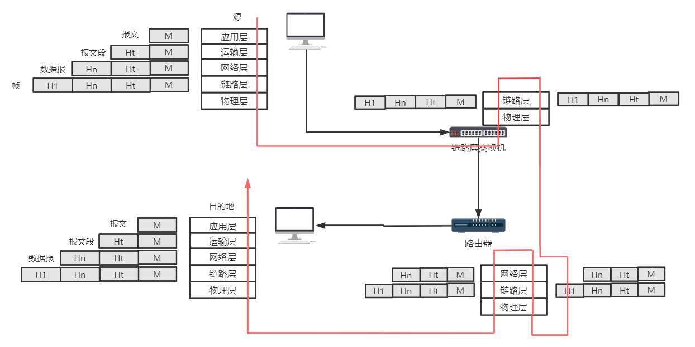

# 计算机网络和因特网

## 1. 什么是因特网

### 1.1 因特网的两种概念解释

- 角度一：因特网的基本硬件和软件组成	
  - 端系统、主机
    - 通信链路
    - 分组交换机
      - 路由器
      - 链路层交换机
  - 端系统通过因特网服务提供商(ISP)接入网络

- 角度二：根据为分布式应用程序提供服务的基础设施来描述因特网
  - 分布式应用程序
  - 因特网作为发布应用程序的方式
  - 端系统提供套接字接口

### 1.2 协议

>  协议定义了在两个或者多个通信实体之间交换的报文的格式和顺序，以及报文发送和/或接受一条报文或者其他事件所采取的动作

## 2 接入网（网络边缘）

处于计算机网络边缘的终端设备如PC、智能手机、服务器等都属于网络边缘，首先关注的是这些终端设备如何接入网络。

### 2.1 家庭接入入方式

- 数字用户线(DSL、Digital Subscriber Line) 

  ​	电话线

- 电缆

- 光纤到户(FTTH、Fiber To The Home)

- 拨号

- 卫星

### 2.2 企业接入方式

- 以太网
- WiFi

### 2.3 广域无限接入

- 3G
- LTE 长期演进

### 2.4 物理媒介

- 双绞铜线
- 同轴电缆
- 光纤
- 陆地无线电信道
- 卫星无线电信道

## 3. 网络核心

### 3.1 分组交换

> 端系统之间彼此交换的数据为报文，执行控制功能，也可以包含数据

> 将长报文划分为较小的数据块，称为分组

在源和目的地之间，分组通过**通信链路**和**分组交换机**传送。

- 采用存储转发传输
- 具有时延和丢包现象
- 通过转发表和路由选择协议选择转发链路（问路的例子）

### 3.2 电路交换

在电路交换网络中，端系统通信会话期间，预留了端系统减沿路径通信所需要的资源(缓存、链路传输速率)。

传统的电话网络：在发送消息之前，必须在发送方和接收方之间简历一条链接。

- 时分复用
- 频分复用

### 3.3 分组交换和电路交换的比较

分组交换类似于 不需要预订的餐馆

- 不能保证每次到达时都能够安排顾客

而电路交换类似与 需要预订的餐馆

- 具有预订的资源占用和繁琐步骤

分组交换更好的实现了共享带宽、比电路交换的方式更简单有效、成本更低

### 3.4 网络的网络

> 因特网服务提供商 ISP
>
> IXP 对等ISP的因特网交换点

如今的因特网由十多个第一层ISP和数十万个较低层的ISP组成。谷歌等内容提供商也建立了专用网络直接与低层的ISP相连。

## 4. 分组交换网络中的时延、丢包和吞吐量

### 4.1. 时延

分组交换网络中时延主要由以下类型

- 节点处理时延

  ​    检查差错等耗时

- 排队时延

  ​    网络拥塞

- 传输时延

  ​    推送到链路上所耗费的时间

- 传播时延

  ​    某比特从一台路由器传输到 另一台所需要的时间

### 4.2 丢包

由于分组交换机只能存储有限的容量，当到达的分组发现排队队列已满时就会丢弃当前分组，造成丢包。

### 4.3 端到端时延

端到端之间每个节点时延的总和。

### 4.4 吞吐量

- 瞬时吞吐量

  某瞬间，目的地主机所接收的速率

- 平均吞吐量

  接收F比特用去T秒时，平均吞吐量为F/T

吞吐量的大小是瓶颈链路速率

## 5. 协议层次及其服务模型

### 5.1 五层网络协议栈

### 5.2 OSI模型

> 开发系统互联模型

在应用层下加入了表示层和会话层。

### 5.3 封装

