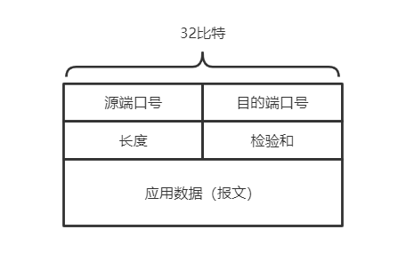
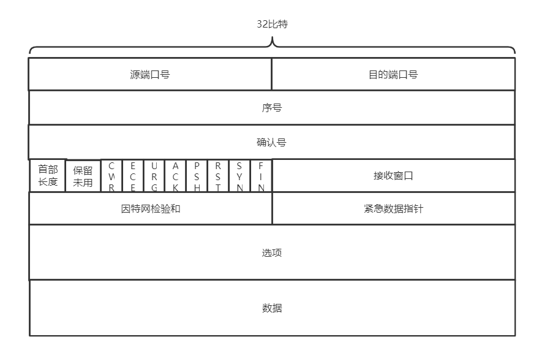
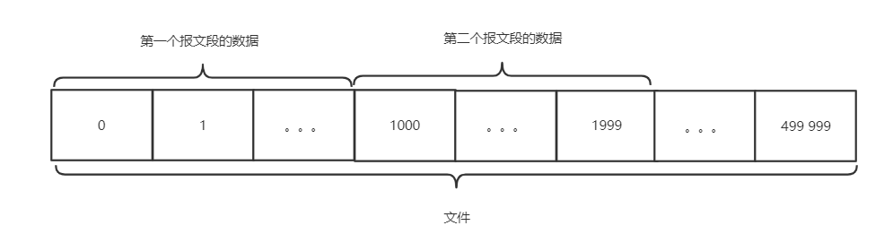

# 运输层服务及协议

## 1. 运输层概述

### 1.1 运输层与网络层的关系

在协议栈中，运输层位于网络层之上。

- 网络层提供了主机之间的逻辑通信
- 运输层为运行在不同主机上的进程之间提供了逻辑通信
- 运输层协议能够提供网络层所不能提供的一些服务，如可靠的数据传输服务等。

### 1.2 运输层协议概述

运输层协议最基本的职责是，将两个端系统间IP交付的服务扩展为运行在端系统上的两个进程之间的交付服务，即多路复用与多路分解，其次是通过报文段首部中包括差错检查字段而提供完整性检查。

对于两大运输层传输协议来说

UDP仅提供了基本的服务即数据交付和差错检查

TCP除了这两个基本服务外还提供了可靠数据传输和拥塞控制等额外的服务

## 2. 多路复用与多路分解

> 多路复用：在发送端，从不同套接字中收集数据块，并为每个数据块封装上首部信息，从而生成报文段，然后将报文段传递到网络层，所有这些工作称为多路复用
>
> 多路分解：在接收端，运输层检测报文段首部信息，标识出接受套接字，将报文段中的数据交付到正确的套接字，这些工作被称为多路分解

为了完成多路复用与多路分解，要求套接字必须要有唯一的标识符，而每个报文段中必须含有特殊字段用来指示目标套接字。

完成标识的特殊字段为：源端口号字段和目的端口号字段。

端口号为16比特的数，大小在 0~65535之间。

其中，0~1023范围的端口号称为周知端口号，是受限制的，它们被保留给诸如HTTP、FTP等周知的应用层协议来使用。

## 3. 无连接运输：UDP（User Datagram Protocol，用户数据报协议）

UDP协议提供了最简单的运输层传输服务，包括了数据交付和差错检查。

### 3.1 UDP报文段结构

- 源端口号用于作为返回地址，方便进程之间的相互通信
- 目的端口号用于标识目的端系统中的进程
- 长度字段指示了UDP报文段中的字节数，包括首部加数据
- 检验和用于接收方来检查该报文段是否出现了差错

### 3.2 UDP检验和

检验和用于确定当UDP报文从源到达目的地移动时，其中的比特是否发生了改变。发送方的UDP对报文段中所有16比特字的和进行反码运算，求和时遇到的任何溢出都被回卷（回卷即把前面多出去的1加到最后）。得到的结果被放在UDP报文段中的检验和字段。

在接收方，全部的比特字（包括检验和）加在一起，如果分组中没有出现差错，则求得的和应为1111111111111111.

### 3.3 选择使用UDP的原因

- 关于发送什么数据以及何时发送的应用层控制更加精细
- 无需建立连接
- 无连接状态
- 分组首部开销小

## 4. 面向连接的运输：TCP（Transmission Control Protocol，传输控制协议）

### 4.1 关于TCP连接

- TCP是在不可靠的（IP）端到端网络层之上实现的可靠数据传输协议。

- TCP是面向连接的，这是因为在一个应用进程可以开始向另一个应用进程发送数据之前，这两个进程必须先相互“握手”，建立确保数据传输的参数。

- TCP连接提供的是全双工服务
- TCP连接是点对点的，即在单个发送方与单个接收方之间的连接。“多播”对于TCP而言是不可能的

### 4.2 TCP报文段结构

- 源端口号和目的端口号：和UDP一样，标识目的主机的套接字
- 序号和确认号字段：被TCP发送方和接收方用来实现可靠数据传输服务
- 接收窗口：用于流量控制，指示接收方愿意接受的字节数量
- 首部长度（4比特）：指示了以32比特的字为单位的TCP首部长度，因此TCP首部的长度是可变的，（选项字段通常为空，因此典型的首部长度是20字节）

- 选项：用于发送方与接收方协商最大报文段长度（MSS）时，或者高速网络环境下作为窗口调节因子时使用。
- 标志字段（6比特）
  - ACK比特标识肯定确认，即该报文段包括一个对已被成功接收报文段的确认
  - RST、SYN、FIN比特用于连接建立于拆除
  - PSH、URG在实践中别没有被使用，PSH标识接收方应立即将数据交给上层，URG标识“紧急”，紧急数据由“紧急数据指针”指出。

#### 序号和确认号

TCP将数据看成一个无结构、有序的字节流。序号是建立在传送的字节流之上的。

一个报文段的序号是该报文段首字节的字节流编号。

如上图，假定数据流由一个包含500 000字节的文件组成，其MSS为1000字节，数据流的首字节编号是0，

该TCP将该数据流构建500个报文段，给第一个报文段分配序号0，第二个报文段分配序号1000，第三个报文段分配序号2000，依此类推，将每个序号填入对应报文段的首部序号字段中

主机A填充进报文段的确认号是主机A期望从主机B收到的下一字节的序号

假设主机A收到了来自主机B的编号为0~535的所有字节，则在它打算发送给B的报文段中，确认号字段中就填入536

假设主机A收到了来自主机B的包含0\~535的报文段和900\~1000的报文段，而没有收到536\~899的报文段。此时A到B的下一个报文段将在确认号字段中包含536。因此TCP提供的是累计确认。

### 4.3 往返时间的估计与超时

TCP采取的是指数加权移动平均方法来估计报文段的往返时间

$$ EstimatedRRT = (1-\alpha) * EstimatedRRT + \alpha * SampleRRT$$

定义

$$DevRTT = (1 - \beta) * DevRTT + \beta * |SampleRRT - EstimatedRRT|$$

用于估算$SampleRTT$与$EstimatedRRT$的偏离程度

于是设置重传超时的时间间隔为

$$TimeoutInterval = EstimatedRRT + 4 * DevRTT $$

### 4.4 可靠的数据传输

TCP提供了可靠数据传输服务，可靠指的是无损坏、无间隙、非冗余、按序。

- 超时间隔加倍，当超时事件发生时，TCP重传具有最小序号的还未被确认的报文段，在TCP重传时，会将下一次的超时间隔设置为先前的两倍。
- 快速重传，当发送方接收到3个冗余ACK时，TCP就会执行快速重传
- 流量控制，流量控制不同于拥塞控制，是为了消除接收方缓存溢出的可能性。简单说就是利用首部接收窗口字段来指示接收方缓存中还有多少可用空间

### 4.5 TCP连接管理

建立TCP连接的三次握手过程。

第一步：客户端的TCP首先向服务端的TCP发送一个特殊的TCP报文段。该报文段中不包含应用层数据。在报文段的首部，标志物SYN置为1，这个特殊报文段即被称为SYN报文段。同时，客户会随机选择一个初始序号（client_isn），将此编号放置于该起始的TCP  SYN报文段的序号字段中；

第二步：一旦包含TCP SYN报文段的IP数据报到达服务器主机，服务器会从该数据报中提取出TCP SYN报文段，为该TCP连接分配缓存和变量，并向该客户TCP发送允许连接的报文段。这个允许连接的报文段也不包含应用层数据。但是在该报文段首部包含3个信息。

- SYN比特置为1
- 首部确认号字段置为client_isn + 1
- 服务器选择自己的初始序号 server_isn ，并将其放置到TCP报文段首部的序号字段中。该报文段被称为SYNACK报文段

第三步：在收到SYNACK报文段后，客户要给该连接分配缓存和变量。客户主机则向服务器发送另外一个报文段；这最后一个报文段对服务器的允许连接的报文段进行了确认。此时SYN被置为0，确认号被置为server_isn + 1；第三个阶段下，可以在报文段负载中携带客户到服务器的数据。

TCP连接断开的过程

参与一条TCP连接的两个进程中的任何一个都能终止该连接

客户应用进程发出一个关闭连接命令，引起客户TCP向服务器进程发送一个特殊的TCP报文段。这个特殊的报文段让其首部的标志位FIN比特置为1。当服务器接收到该报文后，就向发送方回送一个确认报文段

服务器发送自己的终止报文段，其FIN比特也被置为1，最后客户对这个服务器的终止报文段进行确认，此时两台主机上用于该连接的所有资源就被释放了

### 4.6 TCP拥塞控制

TCP拥塞控制机制跟踪一个额外的变量，即拥塞窗口。拥塞窗口表示为cwnd，它对TCP发送方能向网络中发送流量的速率进行了限制。可以理解为能够像网络层发送的数据长度

TCP拥塞控制算法包含三个主要部分

- 慢启动
- 拥塞避免
- 快速恢复

#### 4.6.1 慢启动

当一条TCP连接开始时，cwnd的值通常设置为一个MSS的较小值。

在慢启动阶段，cwnd的值以一个MSS开始并且每当传输的报文段首次被确认就增加一个MSS。因此，TCP发送速率起始慢，但在慢启动阶段以指数增子。

慢启动阶段结束的标志 

- 当出现有超时指示的丢包事件时，TCP发送方将cwnd设置为1并重新开始慢启动过程。将第二个状态中的ssthresh（慢启动阈值）设置为cwnd/2
- 当cwnd的值达到sshresh时，结束慢启动状态转移到拥塞避免模式
- 当检测到3个冗余ACK时，TCP执行快速重传，并进入到快速恢复状态

#### 4.6.2 拥塞避免

进入拥塞避免时，cwnd的值大约是上次遇到拥塞时的值的一半。

此阶段中，每个RTT只将cwnd的值增加一个MSS

当出现超时时，cwnd的值被设置为1个MSS，当丢包事件出现时，ssthresh的值被更新为cwnd值的一半。

当出现三个冗余ACK事件时，TCP将cwnd的值减半，ssthresh的值记录为cwnd的一半，之后进入快速恢复状态。

#### 4.6.3 快速恢复

在快速恢复中，对于引起TCP进入快速恢复阶段状态的缺失报文段，对收到的每个冗余ACK，cwnd的值增加一个MSS。最终当丢失报文段的一个ACK到达时，TCP在降低cwnd后进入拥塞避免状态。

如果出现超时事件，快速恢复在执行如同慢启动和拥塞避免中相同的动作后，迁移到慢启动状态。

TCP的拥塞控制体现了AIMD的特性：即加性增、乘性减。